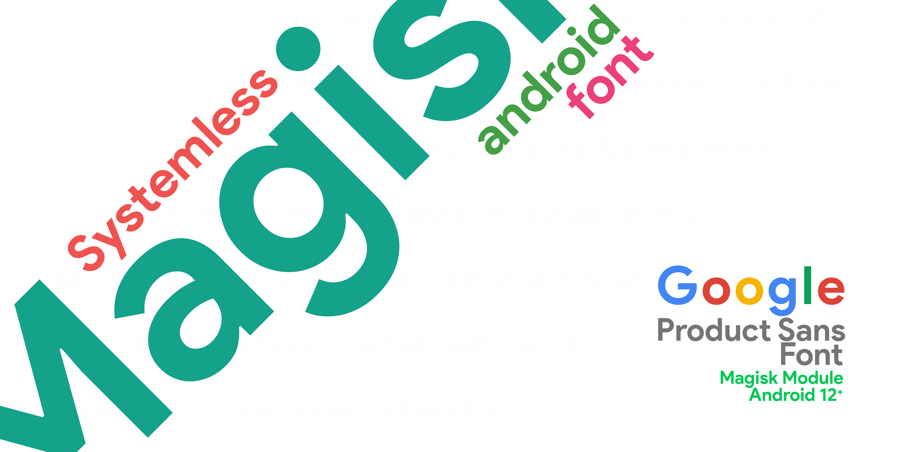

#  Google Product Sans Font for Android 12 and above

This module helps you to install Google Product Sans Font systemlessly though Magisk.

*Google Product Sans Font is a Magisk module that replaces the default Android system font (i.e. Roboto) with Google Product Sans (Android 12).*

This **sans-serif** typeface is the system UI font for Google Pixel Android and is the default font for Google apps. Google Product Sans Font features four weights, variable optical sizes for headline and body text. 

***Google Product Sans Font currently doesn't supports many languages across Latin, Greek, and Cyrillic scripts, but a fix is coming soon.***